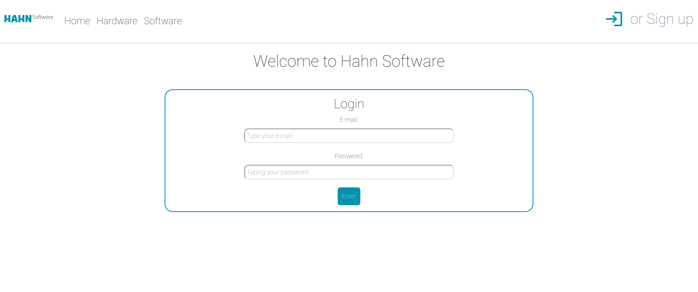
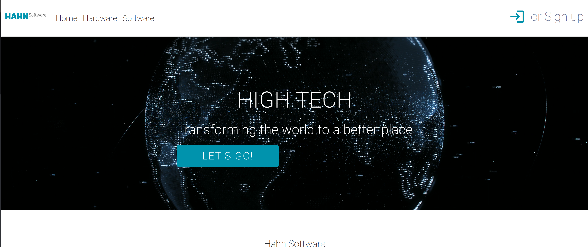
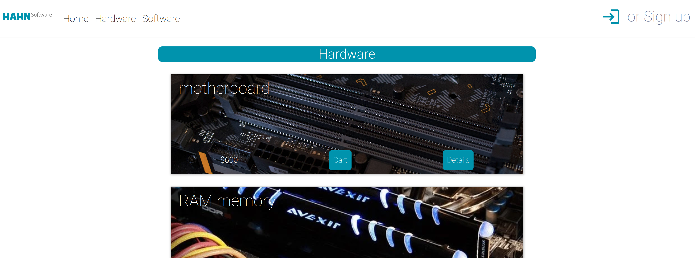
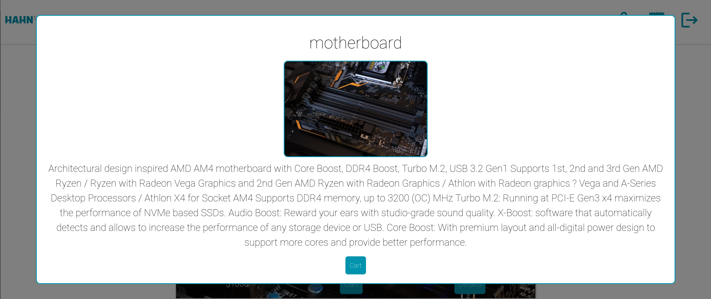
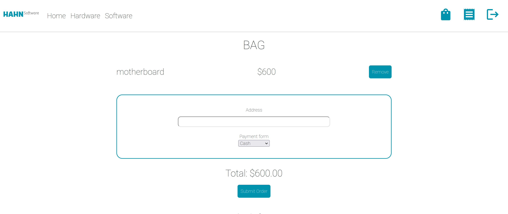
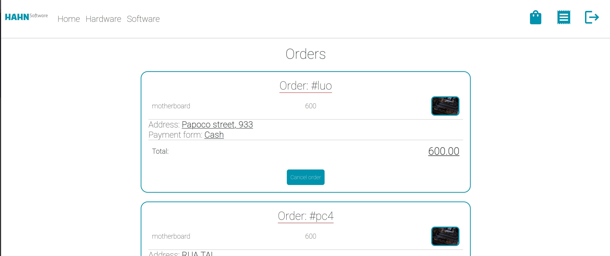
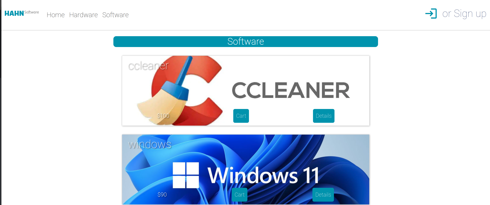

<br><br>
This project is a full stack and totally responsive webapp, for the Hahn Software. In this app we can create a user and login, see the cart, choose the products that we want, put the information for the order and do the order. If we want we can cancel the order or change the address or payment form.

### App screens.


<br>

<br>

<br>

<br>

<br>

<br>

<br>


### 👉 [You can acess here!](https://hahnsoftware-project.web.app)

or here 👉 hahnsoftware-project.web.app

### Built With

- Vue.js
- Typescript
- SASS
- Firebase
- Bootstrap

<br>

## 🚀 Installing <Hahn_Software>

<br>

Clone the repo

```sh
git clone https://github.com/pauloteixeira01/project-hahnSoftware
```

Download dependencies:

```sh
yarn
```

<br>

## ☕ Use

<br>

### Compile and Hot-Reload for Development

```sh
yarn run dev
```

### Type-Check, Compile and Minify for Production

```sh
yarn run build
```

### Lint with [ESLint](https://eslint.org/)

```sh
yarn run lint
```

<br>

## 📝 License

<br>

Distributed under the MIT License. See `LICENSE.txt` for more information.

<p align="right">(<a href="#top">back to top</a>)</p>
